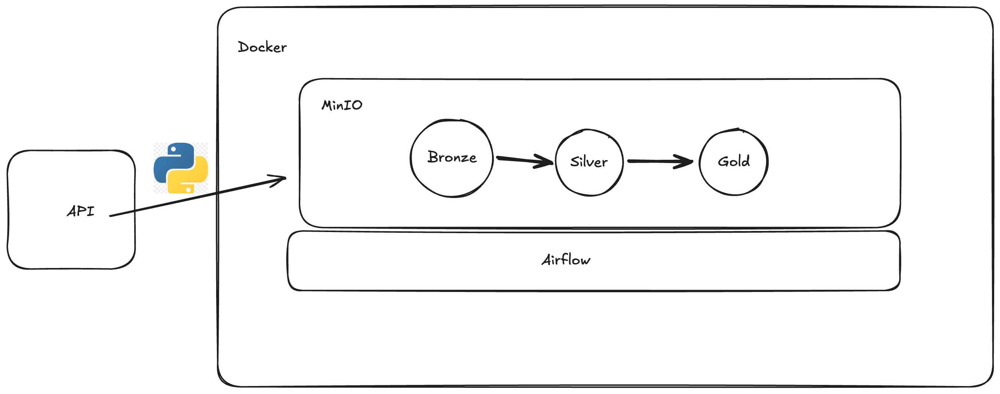

# Desafio técnico BEES

## Tutorial para execução do projeto

- O desafio técnico foi desenvolvido usando as seguintes configs em um MacM1:
    - JDK 11 
    - Spark 3.5.0
    - Delta 3.1.0
    - Airflow 2.7.2
    - MinIO
    - Docker Desktop

Com docker instalado, execute os seguintes comandos na raiz do projeto:

- `docker-compose build`
- `docker-compose up -d`

Com isso, os componentes serão provisionados. Você consegue acessar via `docker-compose ps` para verificar as portas que foram disponibilizadas para as ferramentas, mas aqui os importantes são o Airflow e MinIO, que você pode acessar pela url `localhost.com:8080` e `http://localhost:9001/login`, respectivamente. É bom esperar uns 20seg para tentar acessar o airflow porque pode dar.

- **login_airflow**: admin
- **password_airflow**: admin

- **login_minio**: minioadmin
- **password_minio**: minioadmin

## Monitoramento/Alerta

- Para o monitoramento, pode ser utilizado o envio de alertas para um canal do slack, ou para email/sms, utilizando as features presentes no Airflow para fazer isso.
- Outro tipo de monitoramento e alertas, é criar um pipeline para coletar os metadados das execuções do airflow e com isso gerar dashboards no Grafana para acompanharmos o tempo médio de execução das tasks/DAGs, DAGs que mais falham, etc.
- Pode ser aplicado expectations, utilizando o Great Expectations, para monitorar e alertar, em caso de erros.

## Melhorias que podem ser feitas
Infelizmente, devido ao trabalho, faculdade e vida pessoal, não consegui dar o foco que eu gostaria para entregar um projeto com mais qualidade, entretanto, deixo alguns pontos que podem ser melhorados no projeto

- Aplicação de data quality utilizando o Great Expectations para garantir que os dados estão chegando como o esperado, tanto em quantidade quanto em consistência.
- Ocultar as credenciais de acesso ao endpoint, criando variáveis no ambiente do Airflow e compartilhando no job spark.
- Criar um arquivo de controle do offset das páginas para que não seja necessário pegar o full todos os dias, e com isso só coletar os dados das páginas que ainda não foram obtidas.

## Arquitetura

